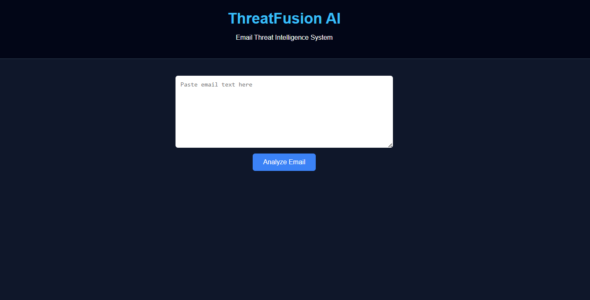
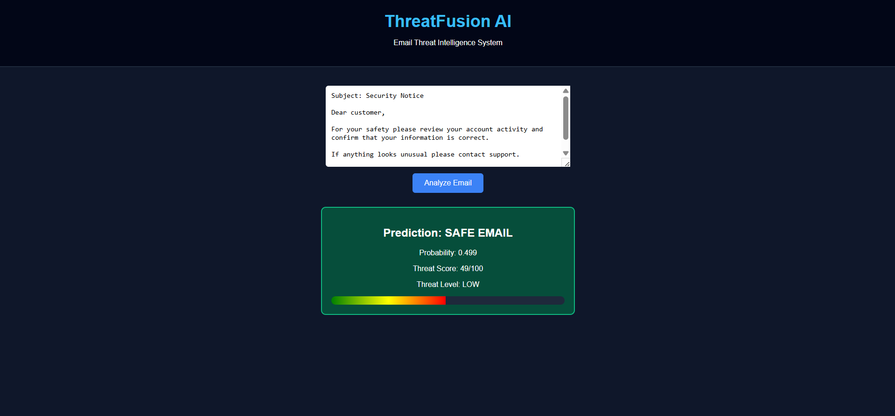
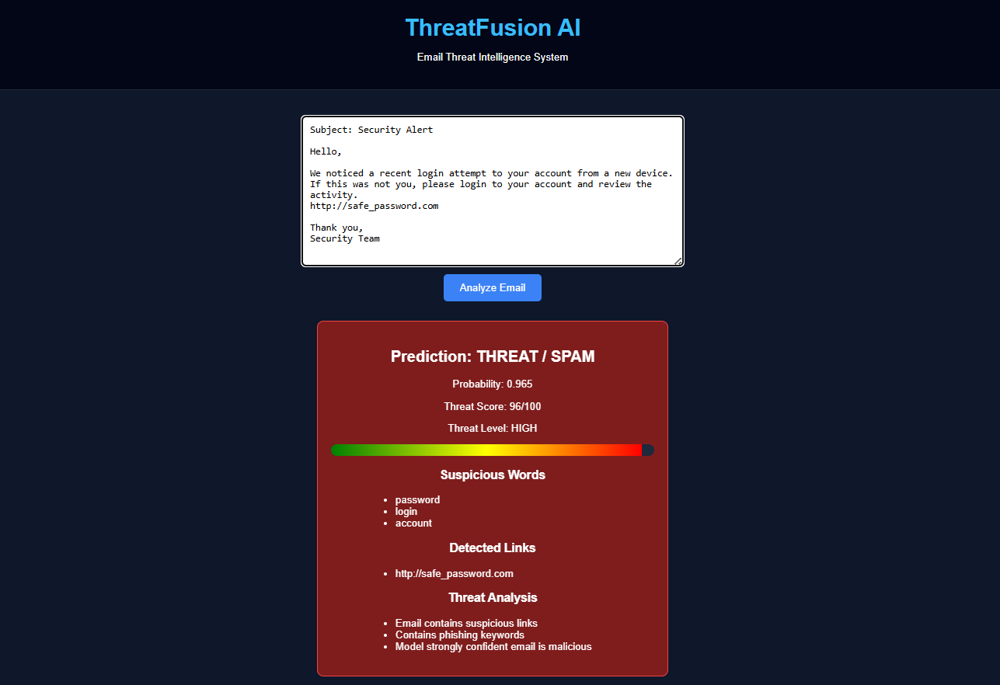

# ThreatFusion AI – Email Threat Detection System

ThreatFusion AI is an **AI-powered email threat analysis system** that detects **spam, phishing attempts, and suspicious email content** using Natural Language Processing (NLP) and machine learning.

The system analyzes email text and provides:

* Threat classification (Safe / Spam)
* Threat probability score
* Suspicious keyword detection
* URL detection
* Threat explanation insights

It also includes a **Flask API and an interactive cybersecurity-style web dashboard** for real-time email analysis.

---

## Project Highlights

* Machine Learning based email threat detection
* Threat score calculation (0–100)
* Suspicious keyword detection
* URL extraction from email content
* Threat explanation engine
* Interactive cybersecurity dashboard
* REST API using Flask
* NLP preprocessing and feature engineering
* Ensemble machine learning models

---

## Demo

Example output after analyzing a phishing email:

```
Prediction: THREAT / SPAM
Probability: 0.92
Threat Score: 92/100
Threat Level: HIGH

Suspicious Words
• verify
• bank
• login

Detected URLs
• http://secure-bank-login.com

Threat Analysis
• Email contains suspicious links
• Contains phishing keywords
• Model strongly confident email is malicious
```

---

## Screenshots

### Web Interface



### Threat Detection Result

---



---

## System Architecture

```
User Email Input
│
▼
Frontend (HTML / CSS / JavaScript)
│
▼
Flask API
│
▼
Text Preprocessing (NLP)
│
▼
TF-IDF Feature Engineering
│
▼
Machine Learning Models
(Logistic Regression + Naive Bayes + SVM)
│
▼
Threat Analysis Engine
│
▼
Threat Score + Explanation
│
▼
Frontend Dashboard
```

---

## Project Structure

```
Threat-Analyzer
│
├── api
│   ├── api.py
│   ├── templates
│   │   └── index.html
│   └── static
│       ├── style.css
│       └── script.js
│
├── data
│
├── models
│   ├── spam_detector.pkl
│   └── tfidf_vectorizer.pkl
│
├── src
│   ├── preprocessing.py
│   ├── feature_engineering.py
│   ├── model_making.py
│   ├── model_evaluation.py
│   └── visualization.py
│
├── main.py
├── prediction.py
├── requirements.txt
└── README.md
```

---

## Installation

### 1. Clone the repository

```bash
git clone https://github.com/AdityaSharma2007/threatfusion-ai.git
cd threatfusion-ai
```

### 2. Create virtual environment

```bash
python -m venv venv
```

### 3. Activate the environment

**Windows**

```bash
venv\Scripts\activate
```

**Linux / Mac**

```bash
source venv/bin/activate
```

### 4. Install dependencies

```bash
pip install -r requirements.txt
```

---

## Running the Application

Start the Flask API server:

```bash
python -m api.api
```

Open the browser:

```
http://127.0.0.1:5000
```

Paste an email and click **Analyze Email**.

---

## API Usage

You can also use the REST API directly.

### Endpoint

```
POST /predict
```

### Example Request

```json
{
"text": "Your account has been suspended. Click here http://secure-login.com to verify."
}
```

### Example Response

```json
{
 "prediction": "THREAT / SPAM",
 "probability": 0.91,
 "threat_score": 91,
 "threat_level": "HIGH",
 "suspicious_words": ["verify","account","login"],
 "urls": ["http://secure-login.com"],
 "explanation": [
   "Email contains suspicious links",
   "Contains phishing keywords"
 ]
}
```

---

## Machine Learning Models

The system uses multiple machine learning algorithms trained on email datasets:

* Logistic Regression
* Naive Bayes
* Support Vector Machine (SVM)
* Voting Ensemble Model

Text features are extracted using **TF-IDF vectorization**.

---

## Technology Stack

| Category      | Technology            |
| ------------- | --------------------- |
| Programming   | Python                |
| ML / NLP      | Scikit-learn, NLTK    |
| Backend       | Flask                 |
| Frontend      | HTML, CSS, JavaScript |
| Visualization | Matplotlib, Seaborn   |
| Deployment    | Local Flask Server    |

---

## Future Improvements

Potential upgrades for the system:

* SHAP explainability for model predictions
* Real-time email scanning
* Phishing domain detection
* Email attachment scanning
* Security dashboard analytics
* Integration with email clients
* Deep learning models for threat detection
* Cloud deployment

---

## Author

**Aditya Sharma**

B.Tech Computer Science Engineering  
Maharishi Markandeshwar Deemed to be University
